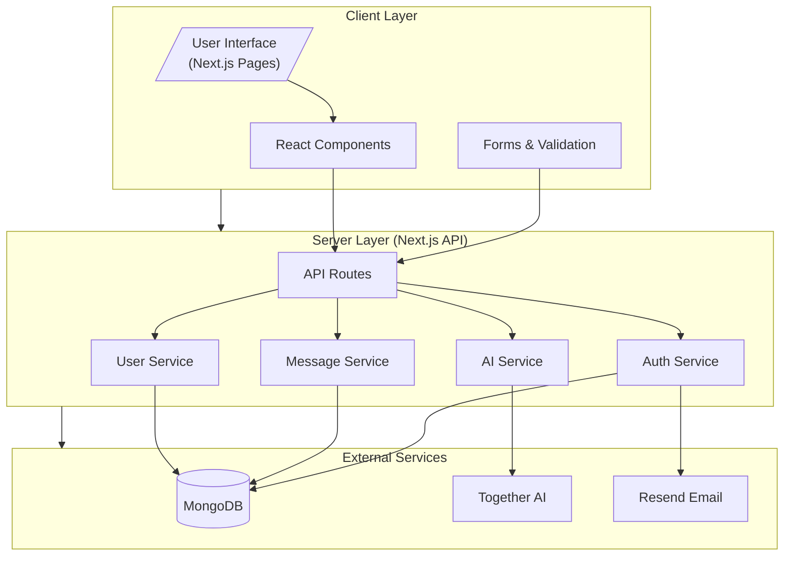
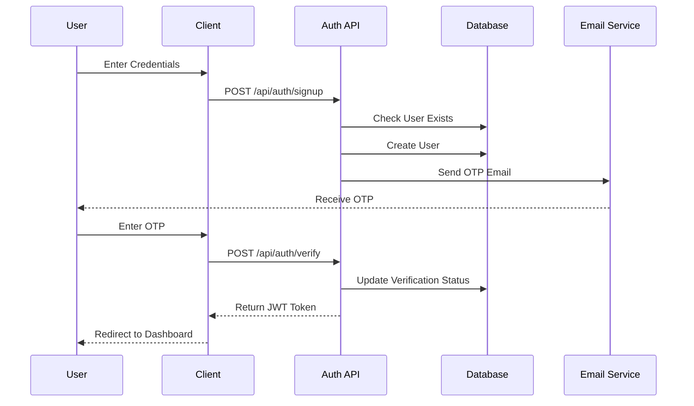

# Application Architecture 🏗️

## System Overview 📋



## Authentication Flow 🔐



## Technology Stack 🛠️

| Layer          | Technologies                                                                                                                                                                                                                                                                                                                 |
| -------------- | ---------------------------------------------------------------------------------------------------------------------------------------------------------------------------------------------------------------------------------------------------------------------------------------------------------------------------- |
| Frontend       |    |
| Styling        |                                                                                                                        |
| Backend        |                                                                                                              |
| Authentication |                                                                                                                                           |
| Tools          |                                                                                                                             |

## Project Structure 📁

```
├── src/
│   ├── app/                 # Next.js 13+ App Router
│   │   ├── api/            # API Routes
│   │   │   ├── auth/       # Auth Endpoints
│   │   │   ├── messages/   # Message Endpoints
│   │   │   └── user/       # User Endpoints
│   │   ├── (auth)/         # Auth Pages
│   │   ├── dashboard/      # Dashboard Pages
│   │   └── messages/       # Message Pages
│   ├── components/
│   │   ├── ui/            # Shadcn Components
│   │   ├── auth/          # Auth Components
│   │   └── messages/      # Message Components
│   ├── lib/
│   │   ├── db.ts          # Database Config
│   │   ├── auth.ts        # Auth Utils
│   │   └── api.ts         # API Utils
│   └── types/             # TypeScript Types
└── public/                # Static Assets
```

## Database Schema 💾

### User Model

```typescript
interface User {
  username: string; // Unique username
  email: string; // Unique email address
  password: string; // Hashed password
  verifyCode: string; // Email verification code
  verifyCodeExpiry: Date; // Verification code expiry
  isVerified: boolean; // Email verification status
  isAcceptingMessages: boolean; // Message acceptance setting
  messages: Message[]; // Array of messages
}
```

### Message Model

```typescript
interface Message {
  content: string; // Message content
  createdAt: Date; // Message timestamp
  _id: ObjectId; // MongoDB document ID
}
```

## API Routes 🛣️

### Authentication Endpoints

| Method | Endpoint                   | Description                 |
| ------ | -------------------------- | --------------------------- |
| POST   | `/api/auth/signup`         | Register new user           |
| POST   | `/api/auth/signin`         | User login                  |
| POST   | `/api/auth/verify`         | Verify email OTP            |
| GET    | `/api/auth/check-username` | Check username availability |

### Message Endpoints

| Method | Endpoint                   | Description            |
| ------ | -------------------------- | ---------------------- |
| POST   | `/api/messages`            | Send anonymous message |
| GET    | `/api/messages`            | Get user messages      |
| PUT    | `/api/messages/:id/accept` | Accept message         |
| DELETE | `/api/messages/:id`        | Delete message         |

## Security Measures 🔒

- ✅ JWT token authentication
- ✅ Password hashing with bcrypt
- ✅ Email verification
- ✅ Rate limiting
- ✅ Input validation with Zod
- ✅ XSS protection
- ✅ CORS configuration
- ✅ Secure HTTP headers

## Environment Variables 🔑

```env
# Database
MONGODB_URI=your_mongodb_connection_string

# Authentication
NEXTAUTH_SECRET=your_nextauth_secret
NEXTAUTH_URL=http://localhost:3000

# Email (Resend)
RESEND_API_KEY=your_resend_api_key

# AI Service
TOGETHER_API_KEY=your_together_api_key
```

## Performance Optimizations 🚀

- ✅ Server-side rendering with Next.js
- ✅ API route caching
- ✅ MongoDB indexing
- ✅ Image optimization
- ✅ Code splitting
- ✅ Bundle optimization

## Future Roadmap 🗺️

1. **Real-time Features**

   - WebSocket integration
   - Live notifications
   - Message typing indicators

2. **Enhanced Security**

   - Two-factor authentication
   - Advanced rate limiting
   - Audit logging

3. **Performance**

   - Redis caching
   - CDN integration
   - Edge functions

4. **Features**
   - Message threads
   - Rich text editor
   - Media attachments
   - User blocking

## Contributing 🤝

1. Fork the repository
2. Create feature branch (`git checkout -b feature/amazing-feature`)
3. Commit changes (`git commit -m 'Add amazing feature'`)
4. Push to branch (`git push origin feature/amazing-feature`)
5. Open a Pull Request

## License 📝

This project is licensed under the MIT License - see the [LICENSE.md](LICENSE.md) file for details.
